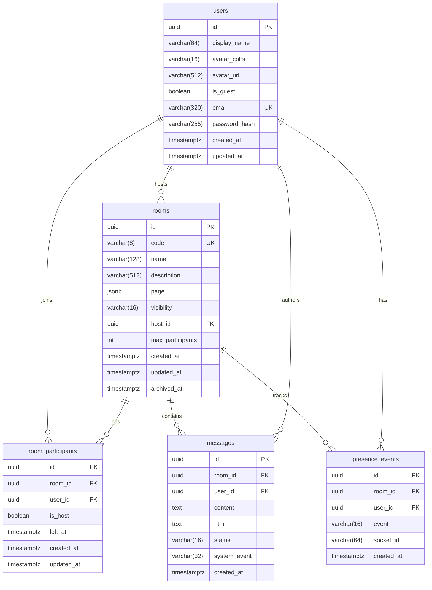

# Database ER Diagram

## Notes

- **`users`** — single table for both guest and full-account users. `is_guest` distinguishes them; `email`/`password_hash` are nullable for guests.
- **`rooms`** — page metadata is stored as JSONB (no separate `pages` table) because it's write-once at room creation. `archived_at` is a soft-delete flag.
- **`room_participants`** — unique constraint on `(room_id, user_id)` ensures a user can be in a room at most once. `left_at` is nullable so we can re-activate on rejoin (preserves the original join timestamp for history).
- **`messages`** — both `content` (raw text) and `html` (sanitized + emoji-replaced) are stored so we never re-sanitize on read. `system_event` is set for join/leave/clear messages and rendered differently by the UI.
- **`presence_events`** — append-only audit log. The **live** presence state lives in Redis, not here. This table is for analytics (session length, return rate, etc.).

## Indexes

| Table                | Index                                  | Purpose                              |
|----------------------|----------------------------------------|--------------------------------------|
| `users`              | `idx_users_display_name`               | Search by name (future friend system)|
| `rooms`              | `uniq_rooms_code` (UNIQUE)             | Lookup by 8-char code                |
| `rooms`              | `idx_rooms_host_id`                    | List rooms by host                   |
| `rooms`              | `idx_rooms_visibility`                 | Filter public rooms (future)         |
| `room_participants`  | `uniq_room_user` (UNIQUE)              | One row per (room, user)             |
| `room_participants`  | `idx_participants_room_id`             | List participants in a room          |
| `room_participants`  | `idx_participants_user_id`             | List rooms a user is in              |
| `messages`           | `idx_messages_room_created`            | Paginated message fetch (DESC)       |
| `messages`           | `idx_messages_user_id`                 | "Messages by user" report            |
| `presence_events`    | `idx_presence_room_created`            | Per-room activity history            |
| `presence_events`    | `idx_presence_user_id`                 | Per-user activity history            |
