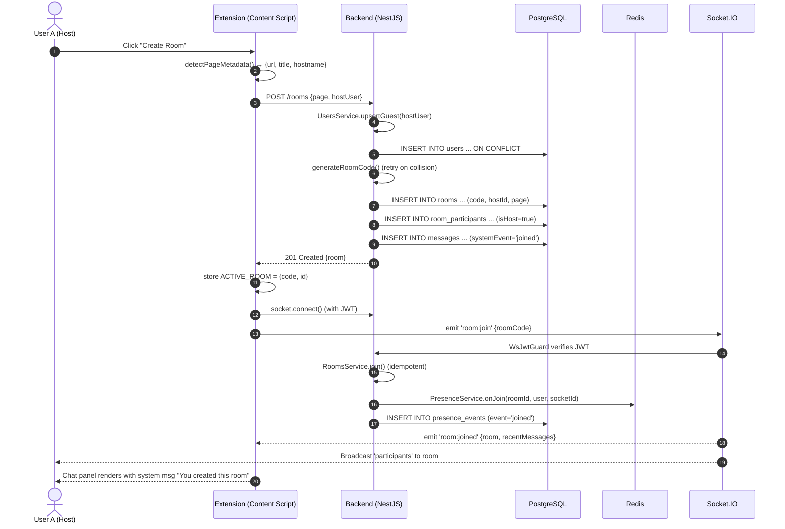
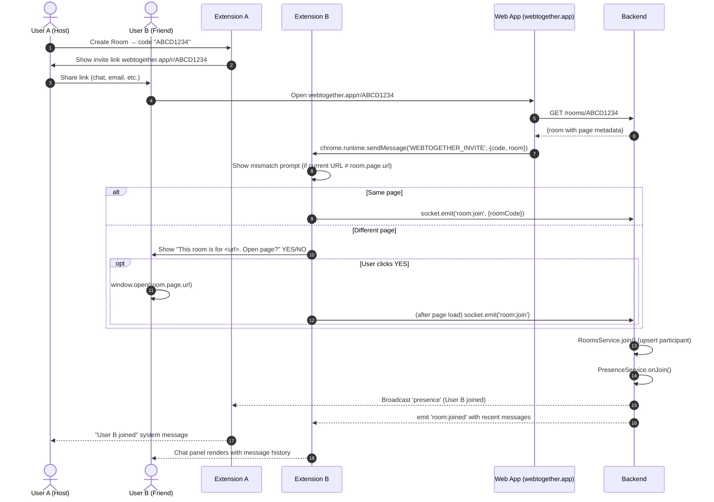
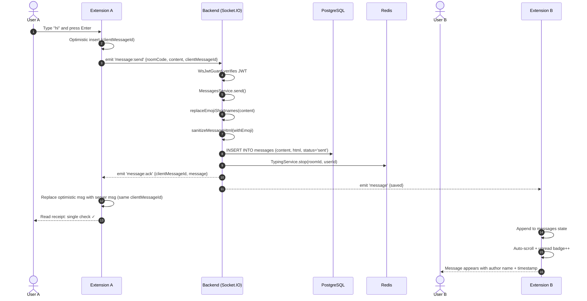
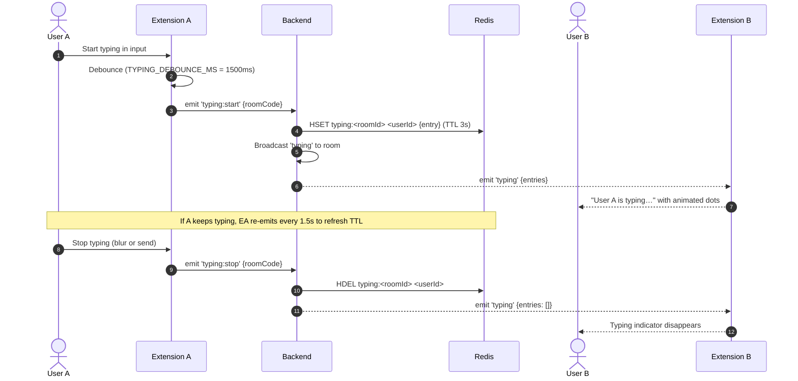
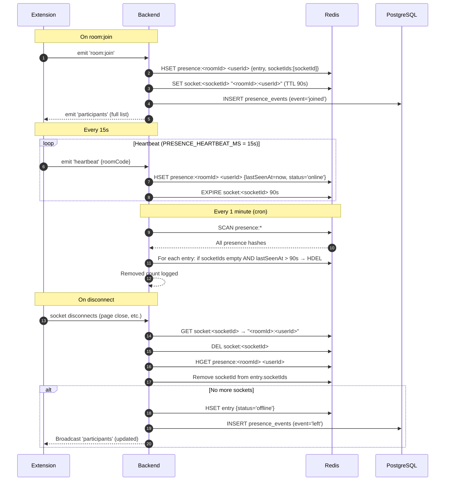

# Sequence Diagrams

All diagrams use [Mermaid](https://mermaid.js.org/) syntax. Render them
in any Markdown viewer that supports Mermaid (GitHub, VS Code with the
Mermaid extension, etc.) or paste into <https://mermaid.live>.

---

## 1. Create Room



---

## 2. Join Room (via invite link)



---

## 3. Send Chat Message



---

## 4. Typing Indicator



---

## 5. Presence & Heartbeat



---

## 6. Leave Room

```mermaid
sequenceDiagram
    autonumber
    actor U as User
    participant E as Extension
    participant S as Backend
    participant DB as PostgreSQL
    participant R as Redis

    U->>E: Click "Leave Room" in Participants panel
    E->>S: emit 'room:leave' {roomCode}
    S->>DB: UPDATE room_participants SET left_at = now()
    S->>DB: INSERT messages (systemEvent='left')
    alt User is host
        S->>DB: UPDATE rooms SET archived_at = now()
        S-->>E: emit 'room:left' {roomId}
        S-->>E: (other clients) broadcast 'participants' empty
        Note over E: Host sees overlay reset to Welcome screen
    else User is participant
        S->>R: PresenceService.onDisconnect(socketId)
        S-->>E: emit 'room:left' {roomId}
        S-->>E: (other clients) broadcast 'participants' updated
        Note over E: Leaver's overlay resets; others see "X left" system msg
    end
    E->>E: storage.remove(ACTIVE_ROOM)
```
